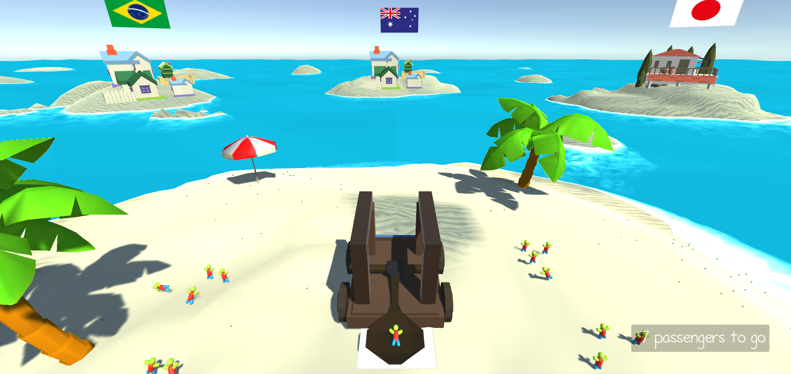
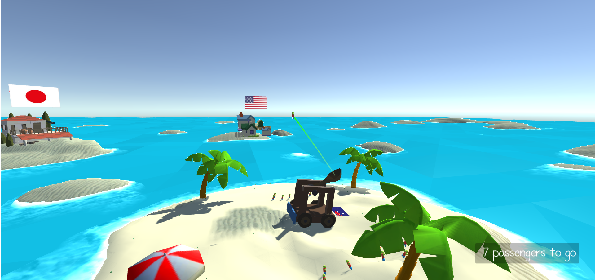
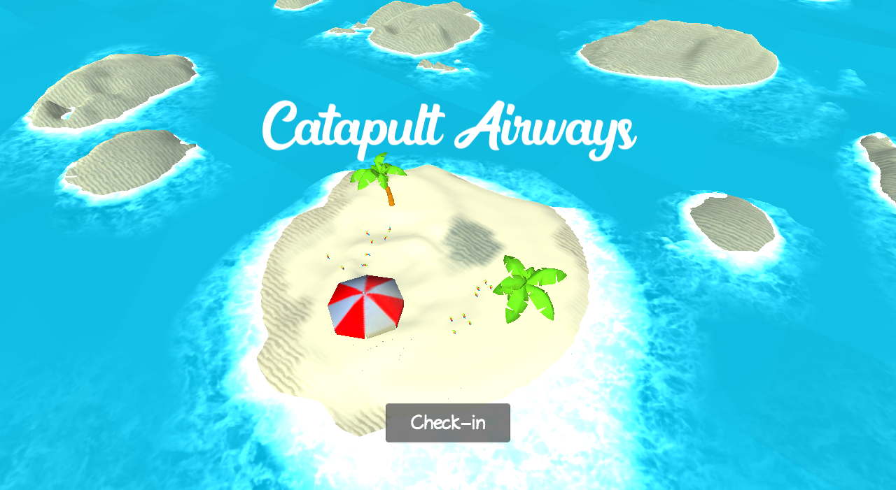

# Global Game Jam 2019

### Overview

The theme of this year's Global Game Jam was "What home means to you". The game was developed in 48 hours by a single programmer in Unity, with the use of free art and audio assets.

### Catapult Airways

Here at Catapult Airways we strive to make your flight a parabolic one!

Fly with us and going home will mean a less agonising journey.

We hope you enjoy your flight!

### Credits

#### Design and programming
 * Jaween Ediriweera

#### Art

 * Simple Houses Lite by Lowlypoly
 * Mobile Low Poly Battle Arena / Tower Defense Desert Pack by Aurynsky
 * Roman City Low Poly Pack 1 - Lite by Terra Nova Creations
 * Island Assets by Lylek Games
 * LowPoly Water by Ebru Dogan
 * Cartoon Palmtree and Umbrellas by 8Bull
 * Terrian generator (Unity Asset Store)
 * Flags from Wikipedia

#### Audio
 * Whoosh by qubodup (freesound.org)
 * Splash, Jumping, G by InspectorJ (freesound.org)
 * Bar Crowd in Belgrade by EpicWizard (freesound.org)
 * Main Engine by EnduringAutomotive (freesound.org)
 * Gasp! by ZerOcarina (freesound.org)
 * waves_1 by haldigital97 (freesound.org)
 * Bassa Island Game Loop - Latinesesque by Kevin MacLeod
